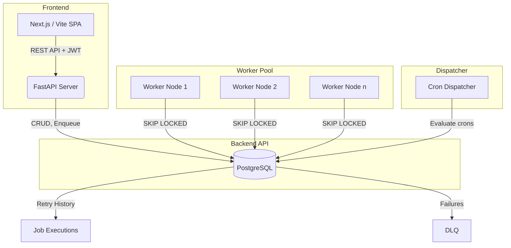

# Distributed Job Scheduler Architecture

## Setup Instructions

1. **Start the database**: `docker compose up -d`
2. **Start the API**: `cd backend && pip install -r requirements.txt && uvicorn app.main:app --reload`
3. **Start the Worker**: `cd worker && python main.py`
4. **Start the Dispatcher**: `cd worker && python dispatcher.py`
5. **Start the Frontend**: `cd frontend && npm install && npm run dev`
