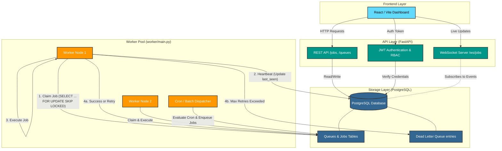

# Architecture Diagram

```mermaid
graph TD
    subgraph Frontend["Frontend Layer"]
        UI[React / Vite Dashboard]
    end

    subgraph Backend["API Layer (FastAPI)"]
        API[REST API /jobs, /queues]
        Auth[JWT Authentication & RBAC]
        WS[WebSocket Server /ws/jobs]
    end

    subgraph Execution["Worker Pool (worker/main.py)"]
        W1[Worker Node 1]
        W2[Worker Node 2]
        Dispatcher[Cron / Batch Dispatcher]
    end

    subgraph Database["Storage Layer (PostgreSQL)"]
        DB[(PostgreSQL Database)]
        Q_Table[Queues & Jobs Tables]
        DLQ_Table[Dead Letter Queue entries]
    end

    %% Frontend to Backend Connections
    UI -- HTTP Requests --> API
    UI -- Auth Token --> Auth
    UI -- Live Updates --> WS

    %% Backend to Database Connections
    API -- Read/Write --> DB
    Auth -- Verify Credentials --> DB
    WS -. Subscribes to Events .- DB

    %% Worker Operations
    W1 -- "1. Claim Job (SELECT ... FOR UPDATE SKIP LOCKED)" --> Q_Table
    W1 -- "2. Heartbeat (Update last_seen)" --> DB
    W1 -- "3. Execute Job" --> W1
    W1 -- "4a. Success or Retry" --> Q_Table
    W1 -- "4b. Max Retries Exceeded" --> DLQ_Table

    W2 -- "Claim & Execute" --> Q_Table
    
    Dispatcher -- "Evaluate Cron & Enqueue Jobs" --> Q_Table

    DB --- Q_Table
    DB --- DLQ_Table

    classDef frontend fill:#61dafb,stroke:#333,stroke-width:2px,color:#000;
    classDef backend fill:#009688,stroke:#333,stroke-width:2px,color:#fff;
    classDef db fill:#336791,stroke:#333,stroke-width:2px,color:#fff;
    classDef worker fill:#ff9800,stroke:#333,stroke-width:2px,color:#fff;

    class UI frontend;
    class API,Auth,WS backend;
    class DB,Q_Table,DLQ_Table db;
    class W1,W2,Dispatcher worker;
```
