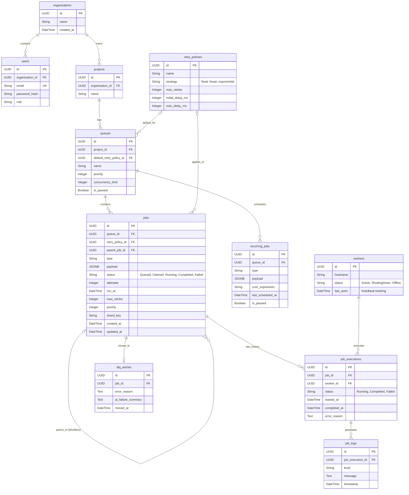

# Entity Relationship (ER) Diagram

### Indexes & Performance
*   **Job Claiming Index:** `ix_jobs_claim` on `jobs (status, run_at, priority)` enables `SKIP LOCKED` to claim ready jobs without full table scans.
*   **Sharding Index:** Index on `jobs (shard_key)` allows horizontal partitioning.
*   **User Lookups:** Unique index on `users (email)` guarantees fast authentication resolution.
