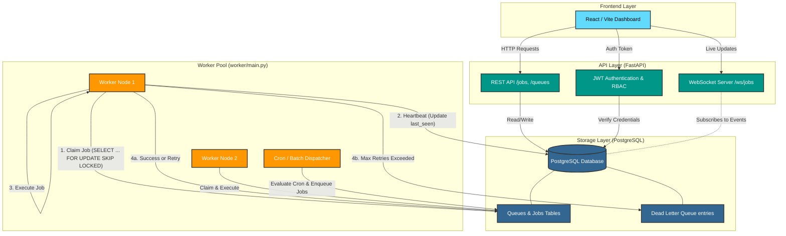
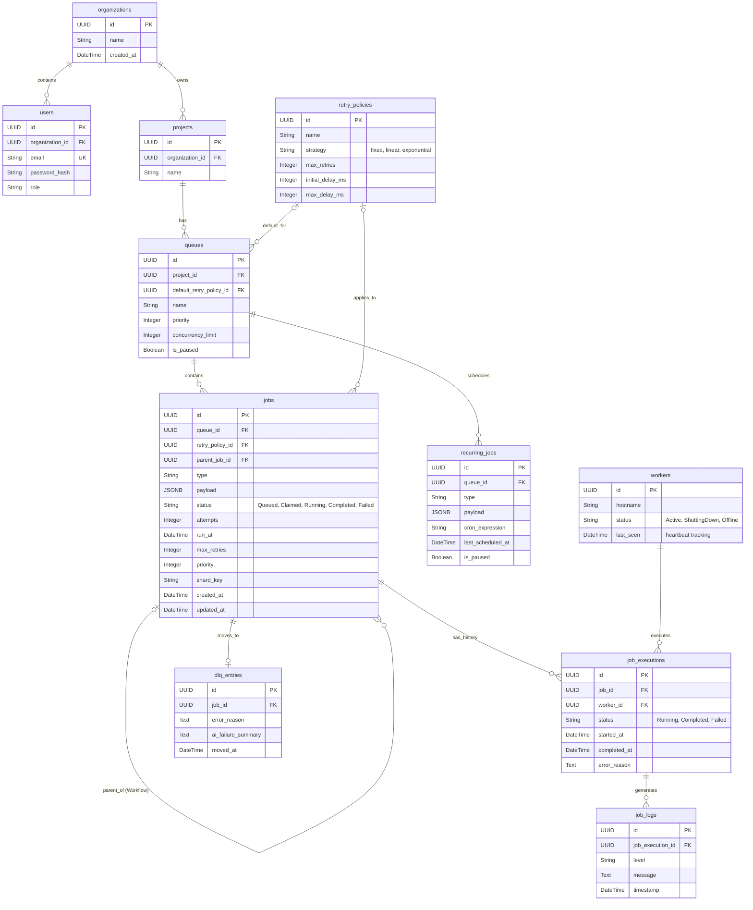

# Codity: Distributed Job Scheduling Platform
**Project Submission**

---

## 1. Executive Summary
Codity is a production-inspired, distributed job scheduling platform capable of reliably executing asynchronous background jobs across multiple worker nodes. The system is built with a decoupled architecture utilizing a **FastAPI (Python)** backend, a **PostgreSQL** database for ACID-compliant state management, and a **React (Vite + Tailwind)** frontend dashboard for complete system observability.

The core of the system achieves high reliability and concurrency without external message brokers (like Redis or RabbitMQ) by leveraging PostgreSQL's `SELECT ... FOR UPDATE SKIP LOCKED` mechanism.

---

## 2. Architecture Diagram
The platform is separated into distinct, scalable domains communicating through strict boundaries.



---

## 3. Database Entity Relationship (ER) Diagram
The schema is highly normalized, featuring strict foreign keys, lifecycle execution trails, and queue sharding support.



### 3.1 Indexes & Performance
*   **Job Claiming Index:** `ix_jobs_claim` on `jobs (status, run_at, priority)` enables `SKIP LOCKED` to claim ready jobs without full table scans.
*   **Sharding Index:** Index on `jobs (shard_key)` allows horizontal partitioning.
*   **User Lookups:** Unique index on `users (email)` guarantees fast authentication resolution.

---

## 4. API Documentation
The complete, interactive OpenAPI (Swagger) documentation is auto-generated and hosted at `/docs` when running the backend. Below is a summary of the core REST interface.

### Authentication & Authorization
*   `POST /auth/register` - Register a new User and Organization.
*   `POST /auth/login` - Authenticate and receive a JWT access token.

### Queues Management
*   `GET /queues` - List all queues for the authenticated project.
*   `POST /queues` - Create a new queue (configure concurrency limits, pause states).
*   `PUT /queues/{id}` - Pause/Resume queues or update concurrency logic.

### Job Lifecycle
*   `POST /jobs` - Enqueue a single job (immediate or delayed via `run_at`).
*   `POST /jobs/batch` - Atomically enqueue a bulk array of jobs.
*   `GET /jobs` - Paginated job explorer (filter by status, queue, or search).
*   `GET /jobs/{id}` - Retrieve full job execution history and attached logs.

### Observability
*   `WS /ws/jobs` - WebSocket streaming endpoint for real-time metrics.

---

## 5. Design Decisions & Major Trade-offs

This section outlines the engineering rationale behind critical system components.

### 5.1 Concurrency Model: PostgreSQL `SKIP LOCKED`
*   **Decision:** We utilized PostgreSQL's `SELECT ... FOR UPDATE SKIP LOCKED` for atomic job claiming instead of a dedicated message broker (e.g., Redis).
*   **Trade-off:** While Redis lists (`BLPOP`) offer marginally faster pure throughput, `SKIP LOCKED` allows us to maintain strict ACID transactional guarantees, achieve zero-dependency infrastructure (just Postgres), and eliminate the "split-brain" problem of keeping an ephemeral queue in sync with a persistent database.

### 5.2 Indexing for Fast Retrieval
*   **Decision:** We applied a composite index `(status, run_at, priority)` on the `jobs` table.
*   **Trade-off:** Write performance (inserts) takes a microscopic hit, but this exact index ensures that workers querying for `status = 'Queued'` and `run_at <= NOW()` can claim jobs in microseconds without triggering sequential table scans.

### 5.3 Queue Statistics Calculation
*   **Decision:** We do not store explicit, mutable statistic counters (e.g., `active_jobs_count = 5`) on the `queues` table.
*   **Trade-off:** Maintaining accurate integer counters in a highly concurrent environment leads to severe write-contention and deadlocks on the queue row. Instead, we calculate statistics on-the-fly using `COUNT(*)` queries which scale infinitely better across horizontal worker nodes.

### 5.4 Job Execution History
*   **Decision:** Every single execution attempt generates a brand new `job_executions` record rather than mutating the original job row.
*   **Trade-off:** This consumes more database storage over time, but provides a critical, immutable audit trail of a job's lifecycle (exactly when it failed, why it failed, and which specific worker node attempted it).

### 5.5 Dead-Worker Recovery
*   **Decision:** Workers emit a heartbeat to the DB every 15 seconds. 
*   **Trade-off:** This introduces slight DB load, but allows a background sweeping process to guarantee that if a worker node crashes unexpectedly (e.g., OOM kill, hardware failure), its "Running" jobs are automatically recovered, marked as failed, and re-queued without manual intervention.

---

## 6. Automated Tests (Critical Functionality)
Test suites are implemented using `pytest` to verify API security barriers and backoff algorithm mathematics.

### Security & API Boundaries (`tests/test_api.py`)
```python
import pytest
from fastapi.testclient import TestClient
from backend.app.main import app

client = TestClient(app)

def test_auth_missing_token():
    """Ensure protected routes reject unauthenticated requests."""
    response = client.get("/queues")
    assert response.status_code == 401
    assert response.json() == {"detail": "Not authenticated"}

def test_login_invalid_credentials():
    """Ensure auth route rejects bad passwords."""
    response = client.post("/auth/login", data={"username": "wrong", "password": "wrong"})
    assert response.status_code == 401
```

### Worker Retry Logic (`tests/test_worker.py`)
```python
import pytest

def test_exponential_backoff_calculation():
    """Verify exponential backoff curve calculates exact milliseconds correctly."""
    initial_delay_ms = 1000
    attempts = 2
    # Exponential formula: initial * (2 ^ (attempts - 1))
    delay_ms = min(initial_delay_ms * (2 ** (attempts - 1)), 60000)
    assert delay_ms == 2000

def test_linear_backoff_calculation():
    """Verify linear backoff curve calculates exact milliseconds correctly."""
    initial_delay_ms = 1000
    attempts = 3
    # Linear formula: initial * attempts
    delay_ms = min(initial_delay_ms * attempts, 60000)
    assert delay_ms == 3000
```
